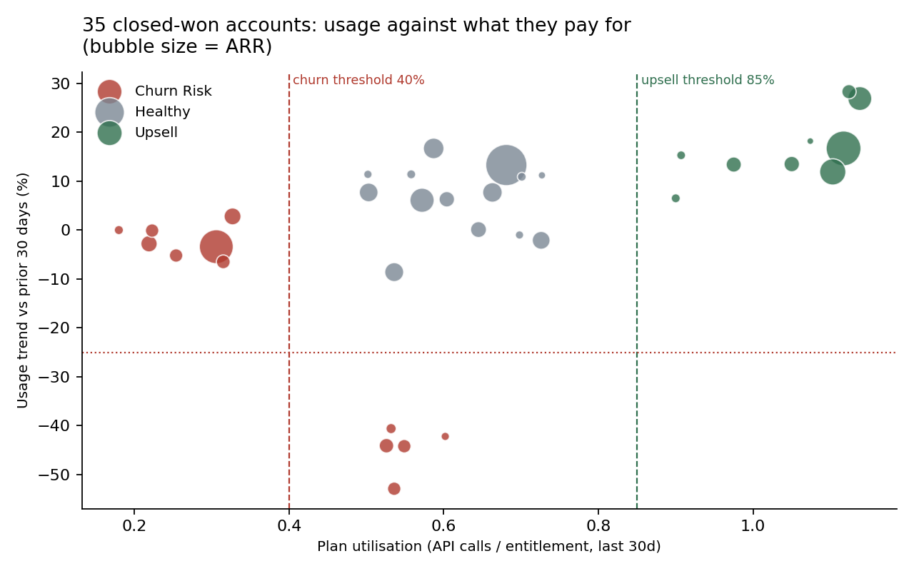

# B2B Revenue & Usage Attribution Pipeline

**Your CRM says the deal closed. Your product logs say nobody is using it. Which one is right?**

A SQL pipeline that joins 4,800 daily API-usage records to CRM deal data across 80 enterprise
accounts, then scores every paying customer on what they actually use versus what they pay for.
Built as a multi-stage CTE chain in SQLite with a thin Python orchestration layer.


---

## Headline findings

Across **35 closed-won accounts** carrying **$3.18M ARR**:

| Segment | Accounts | Share | ARR | Median plan utilisation |
|---|---|---|---|---|
| 🔴 **Churn risk** | **12** | **34%** | **$860,766** | 32% |
| 🟢 **Upsell candidate** | **9** | 26% | $933,638 | 107% |
| ⚪ Healthy | 14 | 40% | $1,384,746 | 62% |

- **$860K of ARR is at risk** — over a quarter of the book — and none of it is visible in the CRM,
  because every one of those deals is marked closed-won and healthy.
- The churn-risk group splits into two distinct failure modes: **7 accounts that never ramped**
  (utilisation below 40% from day one) and **5 that fell off a cliff** (usage down 32–53% in 30 days).
- **3 churn-risk accounts renew within the next 35 days**, which converts this from an analysis into
  a this-week action list.
- The 9 upsell accounts are running at a median **107% of entitlement** — they are already consuming
  more than they contracted for.



Full account-level output: **[results/summary.md](results/summary.md)** ·
**[results/account_flags.csv](results/account_flags.csv)**

---

## The problem

Revenue teams and product teams keep their truth in different systems:

| System | Knows | Blind to |
|---|---|---|
| CRM (`deals`) | Who bought, how much, renewal date | Whether the product is being used |
| Telemetry (`usage_logs`) | Daily API calls, active users, errors | Contract value, renewal exposure |

Neither system alone can tell you that a $180K account is renewing in six weeks having used 18% of
what it pays for. Joining them can, and that is the whole pipeline.

## The data

Synthetic, generated with a fixed seed by [`src/generate_data.py`](src/generate_data.py).

| Table | Rows | Grain |
|---|---|---|
| `accounts` | 80 | Plan tier, contracted monthly API entitlement, licensed seats |
| `deals` | 80 | CRM stage, ARR, owner, renewal date |
| `usage_logs` | 4,800 | One row per account per day: API calls, active users, errors |

## How the pipeline works

[`sql/02_attribution.sql`](sql/02_attribution.sql) is a single five-stage CTE chain. Each stage does
one job, which keeps it debuggable — you can `SELECT *` from any stage in isolation.

```
window_bounds    anchor on the latest log date, derive the 0-29d and 30-59d windows
      ↓
windowed_usage   tag every usage row as 'recent' or 'prior'; attach daily entitlement
      ↓
usage_rollup     conditional aggregation -> one row per account
      ↓
account_health   derive plan utilisation, usage trend, seat activation, error rate
      ↓
flagged          apply the business thresholds
```

The comparison windows are built off `MAX(log_date)` rather than hard-coded dates, so the pipeline
keeps working as new telemetry lands:

```sql
SELECT DATE(MAX(log_date))            AS anchor_date,
       DATE(MAX(log_date), '-29 day') AS recent_start,
       DATE(MAX(log_date), '-59 day') AS prior_start
FROM usage_logs
```

### The flag logic

```sql
CASE
    WHEN plan_utilisation < 0.40                           THEN 'churn_risk'
    WHEN usage_trend <= -0.25 AND plan_utilisation < 0.80  THEN 'churn_risk'
    WHEN plan_utilisation >= 0.85 OR overage_days_30d >= 5 THEN 'upsell'
    ELSE 'healthy'
END
```

Two churn rules, deliberately. A flat-but-low account and a steeply-declining account are different
problems: the first is an onboarding failure, the second is an active defection. Collapsing them
into one flag would send the CSM in with the wrong conversation.

| Metric | Definition |
|---|---|
| `plan_utilisation` | API calls in last 30d ÷ contracted monthly entitlement |
| `usage_trend` | % change in calls, last 30d vs the 30d before that |
| `overage_days_30d` | Days the account exceeded its pro-rated daily entitlement |
| `seat_activation` | Peak active users ÷ seats licensed |

## What I'd do with the output

1. **Work the three imminent renewals first.** Low utilisation plus a renewal date inside 35 days is
   the highest-expected-loss cell in the whole portfolio.
2. **Route the two churn reasons to different plays.** Never-ramped accounts get implementation
   support; falling-off-a-cliff accounts get an exec conversation, because something changed.
3. **Take the 9 overage accounts to the pricing conversation now**, while they are consuming above
   plan and the value argument makes itself.
4. **Push the flags back into the CRM** as a scheduled job so account owners see them without asking
   an analyst.

## Run it yourself

```bash
git clone https://github.com/YOUR-USERNAME/b2b-usage-attribution.git
cd b2b-usage-attribution
pip install -r requirements.txt

python src/generate_data.py   # builds data/attribution.db
python src/pipeline.py        # writes results/ (CSV, summary.md, chart)
```

Or run the query straight against the database:

```bash
sqlite3 -header -csv data/attribution.db < sql/02_attribution.sql
```

## Repo structure

```
b2b-usage-attribution/
├── sql/
│   ├── 01_schema.sql         # table definitions
│   └── 02_attribution.sql    # the 5-stage CTE pipeline
├── src/
│   ├── generate_data.py      # seeded synthetic CRM + telemetry
│   └── pipeline.py           # runs the query, writes results and chart
├── results/
│   ├── account_flags.csv     # per-account scored output
│   ├── summary.md            # churn-risk and upsell tables
│   └── portfolio_health.png
└── .github/workflows/run.yml # CI: pipeline runs on every push
```

## Caveats

- The dataset is **synthetic**. Thresholds are illustrative; in production they would be calibrated
  against observed churn, not chosen by hand.
- 30-day windows are short for enterprise software with seasonal usage. A real version would use a
  longer baseline and control for seasonality.
- Utilisation is measured on API calls only. Seat activation is computed but not yet part of the
  flag logic — it would be the natural next input.

## License

MIT
